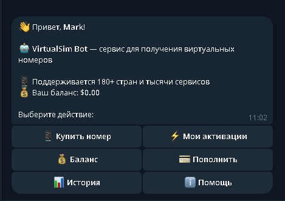
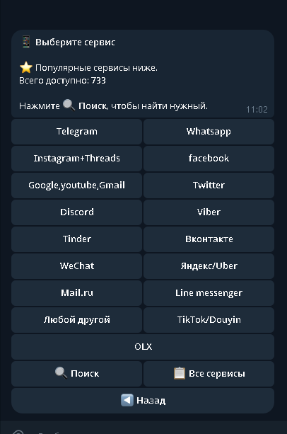
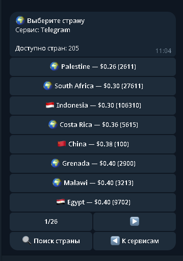

<p align="center">
<h1 align="center">VirtualSim Bot</h1>

<p align="center">
  Telegram-бот для покупки виртуальных номеров и приёма SMS-кодов.<br>
  Работает через API <a href="https://virtualsim.io">virtualsim.io</a>
</p>

<p align="center">
  <a href="https://virtualsim.io">Сайт</a> •
  <a href="https://virtualsim.io/api-docs">API</a>
</p>

---

## Что это

Бот позволяет покупать временные номера телефонов для получения SMS-верификации. 700+ сервисов (Telegram, WhatsApp, Google, Discord и др.), 180+ стран. Оплата криптовалютой через CryptoBot.

---

## Скриншоты

<table>
  <tr>
    <td align="center"><b>Главное меню</b></td>
    <td align="center"><b>Выбор сервиса</b></td>
    <td align="center"><b>Выбор страны</b></td>
  </tr>
  <tr>
    <td></td>
    <td></td>
    <td></td>
  </tr>
</table>

---

## Возможности

- Покупка номеров с актуальными ценами и количеством
- Поиск по сервисам и странам
- Популярные сервисы на главном экране
- Автоматическое получение SMS (поллинг каждые 5 сек)
- Копирование кода по нажатию
- Повторный запрос SMS, отмена с возвратом средств
- Пополнение баланса через CryptoBot (USDT)
- Админ-панель: статистика, управление пользователями, рассылка
- Антиспам и бан-система

---

## Установка

### Требования

- Python 3.10+
- Токен Telegram-бота — [@BotFather](https://t.me/BotFather)
- API-ключ VirtualSim — [virtualsim.io/profile](https://virtualsim.io/profile)
- API-ключ CryptoBot — [@CryptoBot](https://t.me/CryptoBot)

### Запуск

```bash
git clone https://github.com/your-username/virtualsim-bot.git
cd virtualsim-bot
pip install -r requirements.txt
cp .env.example .env
python main.py
```

---

## Настройка (.env)

```env
BOT_TOKEN=токен_бота
ADMIN_IDS=[ваш_telegram_id]

VIRTUALSIM_API_KEY=ключ_api
VIRTUALSIM_BASE_URL=https://virtualsim.io/api/v1

CRYPTOBOT_API_KEY=ключ_cryptobot
CRYPTOBOT_BASE_URL=https://pay.crypt.bot/api

# Relative path = относительно каталога, откуда запускают python. Папка создаётся сама, например data/:
DATABASE_URL=sqlite+aiosqlite:///data/bot.db

MIN_DEPOSIT=1.0
MAX_DEPOSIT=1000.0
CACHE_TTL=300
ACTIVATION_POLL_INTERVAL=5
ACTIVATION_TIMEOUT=600
```

---

## Структура

```
├── main.py                  # Точка входа
├── config.py                # Конфигурация
├── handlers/
│   ├── start.py             # /start, меню, помощь
│   ├── services.py          # Сервисы, страны, поиск
│   ├── activations.py       # Покупка, поллинг SMS
│   ├── balance.py           # Пополнение, история
│   └── admin.py             # Админ-панель
├── keyboards/
│   ├── inline.py            # Инлайн-клавиатуры
│   └── reply.py             # Reply-клавиатуры
├── services/
│   ├── virtualsim.py        # Клиент VirtualSim API
│   ├── cryptobot.py         # Клиент CryptoBot API
│   └── database.py          # Модели и репозитории
├── middlewares/
│   ├── throttling.py        # Ограничение частоты запросов
│   └── ban_check.py         # Проверка бана
└── utils/
    ├── helpers.py            # Кэш, форматирование
    └── logger.py             # Логирование
```

---

## Стек

- **aiogram 3** — фреймворк бота
- **SQLAlchemy 2 + aiosqlite** — база данных
- **aiohttp** — HTTP-запросы
- **pydantic-settings** — конфигурация

---

## API

Бот ходит в публичный **JSON API** (`/api/v1/...`) с параметром `api_key`, как в [документации](https://virtualsim.io/api-docs): `getServices`, `getCountries`, `getPrices`, `orderNumber`, `getStatus`, `setStatus` и т.д. Клиент в `services/virtualsim.py` добавляет таймауты, разбор ошибок и корректную обработку ответов не-JSON / 401 / 429.

Примеры `curl`:

```bash
curl "https://virtualsim.io/api/v1/getServices?api_key=KEY"
curl "https://virtualsim.io/api/v1/getPrices?service=tg&api_key=KEY"
curl -X POST "https://virtualsim.io/api/v1/orderNumber?api_key=KEY" \
  -H "Content-Type: application/json" \
  -d '{"service": "tg", "country": 0}'
```

---

## Ссылки

- [virtualsim.io](https://virtualsim.io) — сайт
- [@virtualsim_bot](https://t.me/virtualsim_bot) — бот
- [t.me/virtualsim_chat](https://t.me/virtualsim_chat) — чат
- [API документация](https://virtualsim.io/api-docs)

---

<p align="center">
  <sub>© 2026 VirtualSim</sub>
</p>
